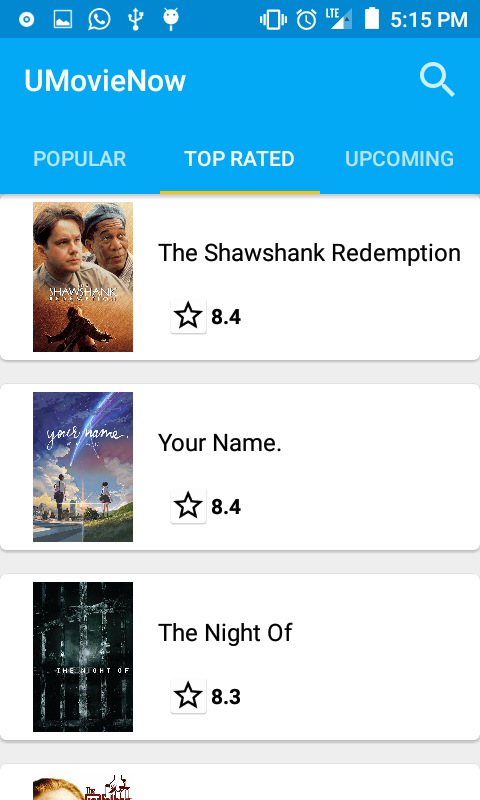
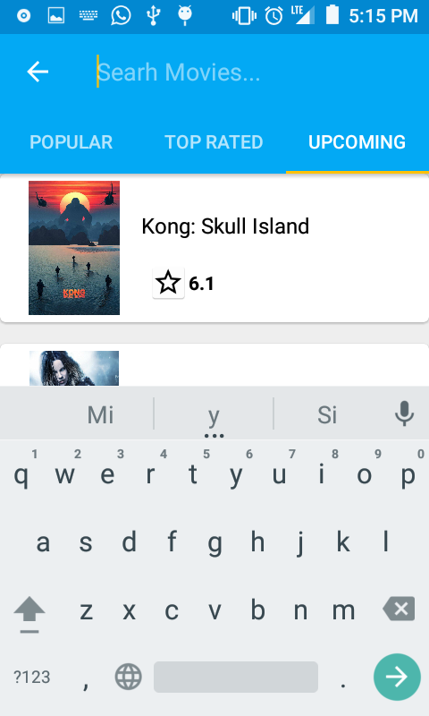
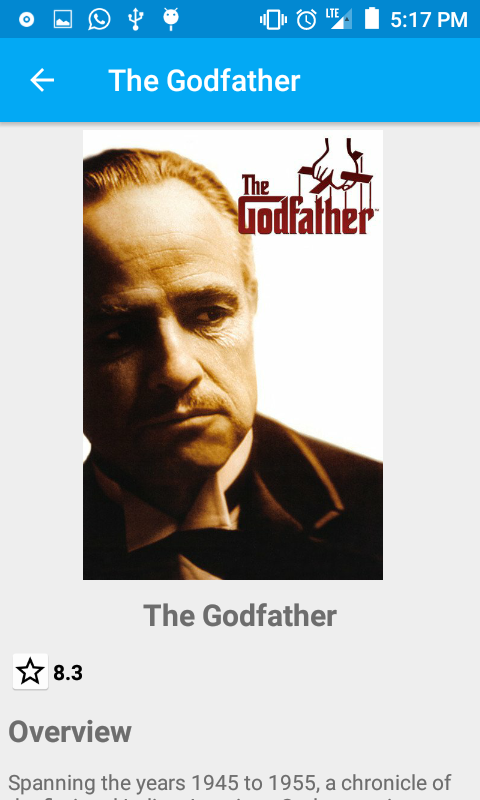
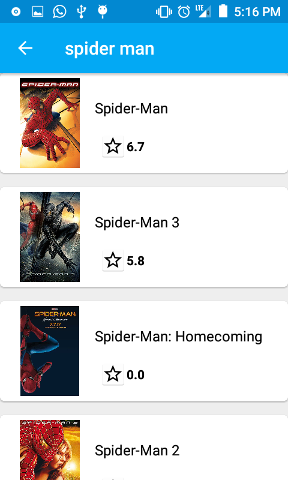

# **UMovieNow** #
Aplicación Android realizada bajo la arquitectura MVP (Modelo-Vista-Presentador)

## **Inicio** ##

## **Peliculas mas votadas** ##

## **Barra de búsqueda** ##

## **Detalle de la Pelicula** ##

## **Resultados de búsqueda** ##

